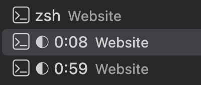
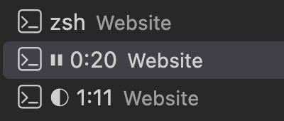
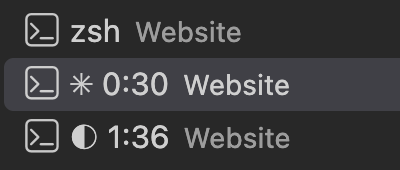

# tab-clock

Shows in the terminal tab what Claude is doing, and for how long:

| Tab | Meaning |
|---|---|
| `◐ 1:31 · Website · Topic` | Claude is working, for 1 min 31 s so far |
| `⏸ 1:31 · Website · Topic` | Claude is waiting for you, e.g. to approve a command |
| `✳ 2:30 · Website · Topic` | done; the last answer took 2 min 30 s |

<table>
  <tr>
    <th>Working</th>
    <th>Waiting for you</th>
    <th>Done</th>
  </tr>
  <tr>
    <td></td>
    <td></td>
    <td></td>
  </tr>
</table>

<sub>The terminal panel in VS Code. The highlighted tab passes through all three
states; the tab below it is a second session that keeps working meanwhile.</sub>

**Why:** one glance at the tab tells you whether switching to another task is
worth it — without opening the session, and without a notification that
interrupts you.

## Install

In a shell (not inside a Claude session):

```
claude plugin marketplace add DrAndreasEisele/claude-plugins
claude plugin install tab-clock@dr-andreas-eisele
```

Then start `claude`, open a session and run:

```
/tab-clock:setup
```

Setup finds out which of three one-time settings outside the plugin are
still needed, asks you **once** to confirm them, backs up every file, and lists
all changes at the end:

| Setting | Why |
|---|---|
| Switch off Claude Code's own tab title | Claude Code writes the title itself; with both writing, the tab would flicker. The plugin shows the same information plus the clock. |
| VS Code only: show the title a program sets, the folder only once | By default VS Code labels a tab with the program name (`zsh`, `node`, a version number) and ignores titles. Other terminals show titles already. |
| A small shell function | Names a new tab `✳ Claude Code` right away; otherwise it shows the shell's own title until your first prompt. |

Afterwards, open a **new** terminal tab and start a **new** session. To undo
everything: `/tab-clock:remove`.

**Only new sessions get the clock.** A session keeps the plugins and settings
it started with. Sessions that already existed before setup — also when you
reopen them later — keep showing Claude Code's own title without a clock.

## Where it works

- macOS and Linux, in any terminal that shows window titles: Terminal,
  iTerm2, GNOME Terminal, Konsole, and the terminal inside VS Code and its
  forks. In tmux only with `set -g set-titles on`.
- **Not** in the chat panel of the VS Code extension or in the desktop app:
  there is no tab there. Windows is not supported.
- Needs only `bash` and standard tools that both systems ship with.
- **Your own hooks stay untouched.** The plugin adds five hooks next to yours
  and changes none of them; they print nothing and never block. Only another
  hook that also sets the tab title would compete with it — setup checks for
  that and tells you.

## Accuracy and limits

- The clock counts in whole seconds from the moment you send the prompt; it
  can differ from Claude's own "Worked for …" by up to one second.
- After the clock comes the project folder — in a git worktree `repo/worktree`,
  e.g. `Website/feature-x`, and `⎇ branch` when the branch is not `main` or
  `master` — then the session name. The name
  appears when you set one with `/rename`; Claude Code's automatic title only
  now and then, because Claude Code rarely writes it while its own tab title
  is off.
- It recognises Esc and the session name from the entries Claude Code writes
  to its transcript. If a Claude Code update changes that format, at worst the
  topic is missing, or after Esc the clock keeps running until your next
  prompt.
- When Claude hands work to a background task (a long build, a wait, a
  background agent), it ends its turn and the tab shows `✳` although the task
  is still running. When the task reports back, Claude continues on its own;
  the tab stays at `✳` until your next prompt.
- When an API error ends the turn — for example a used-up usage limit — the
  tab shows `✳` as well; the error itself is in the session.
- While Claude works, one small background process per session runs the
  clock. It ends by itself when the answer is done, interrupted, a new
  prompt starts, or the session closes.

## Files on your machine

| Path | What | Written by |
|---|---|---|
| `<plugin folder>/hooks/hooks.json` | **the hooks:** run the script when you send a prompt, when Claude waits for you, finishes or stops on an error, or the session ends | plugin install |
| `<plugin folder>/scripts/tab-clock.sh` | sets the tab title, runs the clock | plugin install |
| `~/.claude/settings.json` → `env.CLAUDE_CODE_DISABLE_TERMINAL_TITLE` | Claude Code's own tab title off | `/tab-clock:setup` |
| VS Code user `settings.json` → `terminal.integrated.tabs.title`, `terminal.integrated.tabs.description` (Remote-SSH: the remote's `~/.vscode-server/data/Machine/settings.json`) | tabs show the title a program sets; the description drops the folder, which the title already shows — VS Code users only | `/tab-clock:setup` |
| `~/.zshrc` or `~/.bashrc`, block between `# >>> tab-clock >>>` and `# <<< tab-clock <<<` | names a new tab before the first prompt | `/tab-clock:setup` |
| `<file>.bak-tab-clock-<time>` next to each changed file | backup before every change | setup and remove |
| `$TMPDIR/tab-clock-<user id>/<session>.run`, `.state`, `.done` (Linux usually `/tmp/…`) | current turn and state of a running session; deleted when the turn or session ends | the hooks and the clock, while they run |

`/tab-clock:remove` takes out the settings and the shell block; it asks about
the VS Code setting, which may have been there before. `<plugin folder>` is
`~/.claude/plugins/cache/dr-andreas-eisele/tab-clock/<version>/`.
Installing a plugin also adds entries that Claude Code itself manages —
see [Files on your machine](../../README.md#files-on-your-machine) in the main
README.
